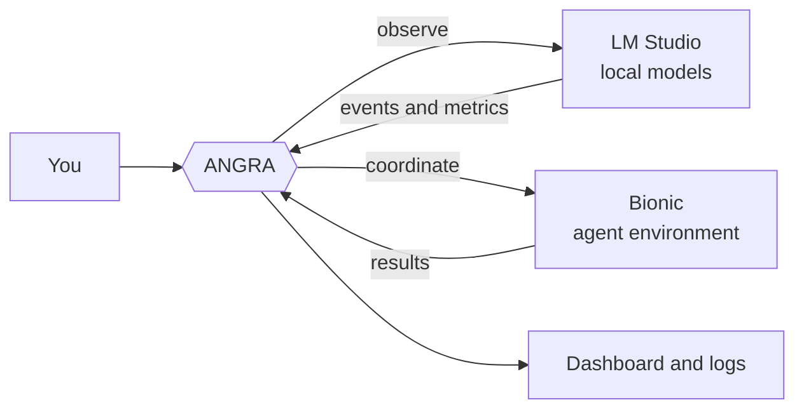

<div align="center">

# Angra Kythons

**Local-first observability and model-to-model coordination for LM Studio and Bionic.**


*Observe. Analyze. Verify. Challenge. Reconstruct. Coordinate.*


[Quick start](#quick-start) · [Features](#features) · [How it works](#how-it-works) · [Commands](#commands) · [Roadmap](#roadmap) · [Security](#security-model) · [Contributing](#contributing)

<!-- Add a demo GIF here: docs/assets/demo.gif -->

</div>

---

## What is ANGRA?

Running several local models does not automatically make them a team, and it
does not tell you what they are actually doing.

ANGRA is a single-file Python tool that sits **between** your local model
runtimes and you:

1. **See** what your local models are doing in real time (LM Studio).
2. **Let models work together** through explicit, scoped links instead of
   copy-pasting between chats (LM Studio and Bionic).

> Models should not only exchange answers. They should exchange **evidence**.

ANGRA is **not** a model, **not** an LLM, and **not** a replacement for
LM Studio or Bionic. It is the layer around them.


## Features

### Real-time observability (LM Studio)

- Model lifecycle monitoring (load / unload / active model)
- Streaming generation tracking
- Generation metrics: **tokens, latency, time to first token (TTFT), tokens/second**
- Context and performance analysis
- Tool-call visibility, where the runtime exposes it
- Reasoning events, **only when explicitly exposed** by the model or interface
- Resource monitoring

### Model collaboration

- Designate a **primary** model and **link** other models to it
- Grant link permissions **per session** (nothing is permanent by default)
- Relay structured evidence between models: verify, challenge, reconstruct
- Bionic integration with resource estimation and a configurable GPU budget

### Engineering principles

- **Zero dependencies.** Python standard library only. No `pip install`.
- **Single file per integration.** Copy it, run it, delete it.
- **Local-first.** Your prompts and outputs stay on your machine unless you
  deliberately configure otherwise.
- **Reversible.** Setup is idempotent, and `uninstall` removes what `install` added.
- **Safe defaults.** Automatic features are off until you turn them on.

## Quick start


### Requirements

- [LM Studio](https://lmstudio.ai) and/or Bionic installed
- Python 3
- At least one local model downloaded

### LM Studio

```bash
# 1. Put Angra_lmstudio.py in your user folder (e.g. C:\Users\<you>)
# 2. Install the `angra` command
py Angra_lmstudio.py install

# 3. Check that everything is wired correctly
angra doctor

# 4. Set a primary model and link a second one to it
angra primary "GPT-OSS-20B"
angra link "GPT-OSS-20B" "DeepSeek-Coder-V2-Lite"

# 5. Allow the link for this session only
angra allow "DeepSeek-Coder-V2-Lite" --session
```


### Bionic

```bash
py Angra_bionic.py

angra-bionic models                        # list available models
angra-bionic select                        # choose a model and confirm
angra-bionic enable                        # estimate resources, confirm, load
angra-bionic config set max_gpu_budget_gb 6
angra-bionic test
angra-bionic doctor
```

## Commands


### `angra` (LM Studio)

| Command | What it does |
| --- | --- |
| `install` | Installs the `angra` command (reversible) |
| `doctor` | Diagnoses setup, connectivity and permissions |
| `primary "<model>"` | Sets the primary model |
| `link "<A>" "<B>"` | Links model B to model A |
| `allow "<model>" --session` | Allows a link for the current session only |
| `uninstall` | Removes everything `install` added |

### `angra-bionic` (Bionic)

| Command | What it does |
| --- | --- |
| `models` | Lists available models |
| `select` | Choose a model and confirm |
| `enable` / `disable` | Estimate resources, confirm, load / unload |
| `config set <key> <value>` | Changes a setting, e.g. `max_gpu_budget_gb 6` |
| `test` | Runs a self-test |
| `status --json` | Machine-readable status |
| `doctor` | Diagnoses setup |
| `uninstall` | Removes everything it added |

## How it works




ANGRA does not run inference. It watches the runtime you already use,
records what happens, and relays structured context between models you have
explicitly linked.

A relayed message separates identity, task, context, constraints and result,
instead of forwarding an entire chat transcript:

```json
{
  "sender": "primary",
  "recipient": "reviewer",
  "type": "task_context",
  "objective": "Review the proposed fix",
  "context": [],
  "constraints": [],
  "status": "ready"
}
```

## Security model

Connecting models is a security boundary, not just a convenience.

- Access to a model does **not** imply access to files, a shell, the network,
  secrets or other models. Capabilities are scoped and explicit.
- Links are **session-scoped by default** (`--session`).
- Never expose an AI runtime directly to an untrusted network.
- Report vulnerabilities privately; see [SECURITY.md](SECURITY.md).

## Status

ANGRA is **alpha**. Interfaces may change between versions. Pin a specific
release for reproducible setups, and treat any feature not listed under
"Features" as experimental.

## Roadmap


- [x] LM Studio integration (`Angra_lmstudio.py`)
- [x] Bionic integration (`Angra_bionic.py`)
- [ ] Unified single-file build with live dashboard (Tkinter)
- [ ] Session storage (sqlite3 / JSON) and exportable reports
- [ ] Evaluation engine and anomaly levels (NORMAL / WATCH / WARNING / ANOMALY)
- [ ] Automated tests and CI
- [ ] Tagged releases with checksums
- [ ] Cross-machine workers (authenticated and encrypted)


## Contributing

Issues and pull requests are welcome. Good first areas: tests, Linux and
macOS support, docs and examples. Please read [CONTRIBUTING.md](CONTRIBUTING.md)
first.

## License

See [LICENSE](LICENSE).

## Author
https://shokribardiya.github.io/Oblivions0.github.io/
https://shokribardiya.github.io/OblivionStudioDev/
Built by **Bardiya Shokri** ([@shokribardiya](https://github.com/shokribardiya))
under the Oblivion project.
Website: <https://shokribardiya.github.io/Angra_AI/>

## Citation

If ANGRA helps your work, please cite it (see `CITATION.cff`).


# ANGRA

**User chooses. LM Studio runs the models. Angra connects them.**

Angra is a small, dependency-free control tool that lets one model already loaded in [LM Studio](https://lmstudio.ai) (the *primary*) ask a second, already-loaded model (the *helper*) a focused question, under rules you set and can revoke at any time.

Angra never loads, downloads, unloads, switches or routes models. It never performs inference and never starts a server. All inference is done by LM Studio.


---

## Contents

1. [What it is (and is not)](#what-it-is-and-is-not)
2. [Requirements](#requirements)
3. [Quick start](#quick-start)
4. [Commands](#commands)
5. [How a consultation works](#how-a-consultation-works)
6. [Permissions](#permissions)
7. [Connection graph rules](#connection-graph-rules)
8. [Safety limits](#safety-limits)
9. [What to expect from it](#what-to-expect-from-it)
10. [Security model](#security-model)
11. [Code structure](#code-structure)
12. [Diagnostics and repair](#diagnostics-and-repair)
13. [Uninstall](#uninstall)
14. [Known limitations](#known-limitations)

---

## What it is (and is not)

Angra is two products in one file:

| | Product A: `Angra.py` | Product B: `angra-bridge` plugin |
|---|---|---|
| Language | Python, standard library only | TypeScript, generated from templates inside `Angra.py` |
| Runs on | Your Python (3.8+) | LM Studio's own Node runtime, using `@lmstudio/sdk` |
| Job | Installer, CLI, owner of state | Exposes four tools to the primary model |
| Touches models? | Never | Only calls `respond()` on an already-loaded helper |

**Angra is:** a permissioned, auditable bridge for one-question-at-a-time consultation.

**Angra is not:** a model router, an agent framework, a load balancer, or a way to merge two models into one. It does not make the primary stronger in general; it lets the primary delegate a small sub-question.

---

in strong hardware ^


## Requirements

- Windows (install, PATH and launcher are Windows-only; read-only commands such as `models`, `loaded`, `doctor`, `self-test` run elsewhere)
- Python 3.8 or newer
- LM Studio with the `lms` CLI available (start LM Studio once, then run `lms bootstrap` if needed)
- A version of `lms` that supports `lms dev --install`
- At least two models loaded by you in LM Studio

---

## Quick start

```bat
py Angra.py install
```

Open a **new** Command Prompt (PATH changes apply to new windows), then:

```bat
angra doctor
angra models
angra primary "my-primary-model"
angra link "my-primary-model" "my-helper-model"
angra allow "my-helper-model" --session
angra links
```

Then ask your primary model something hard in LM Studio. It can call `angra_consult_model` when it decides a helper is useful.

State lives in `%LOCALAPPDATA%\Angra` (override with the `ANGRA_HOME` environment variable).

---

## Commands

| Command | What it does |
|---|---|
| `angra` | Dashboard and interactive shell |
| `status`, `models`, `loaded` | Show state, all models, loaded models |
| `primary "<model>"` | Record your primary (does **not** switch LM Studio) |
| `link "<primary>" "<helper>"` | Create a primary -> helper link (helper must be loaded) |
| `unlink "<primary>" "<helper>"` | Remove a link |
| `connect "<model>"` | Link a model to your declared primary |
| `disconnect "<model>"` | Remove its links and revoke its permission |
| `allow "<model>" [--once \| --session]` | Authorize a helper (default: enabled until denied) |
| `deny "<model>"` | Revoke authorization |
| `permissions`, `links` | Show permissions and the connection graph |
| `doctor`, `self-test` | Diagnostics; no inference is ever performed |
| `install`, `repair`, `uninstall` | Lifecycle |
| `version`, `help`, `exit` | Misc |

Flags: `--no-color`, `--ascii`.


No command writes to a model. `uninstall` has the largest write surface (state, plugin, launcher, PATH entry).

---

## How a consultation works


The primary model sees four tools:

| Tool | Purpose | Side effects |
|---|---|---|
| `angra_status` | Primary, links, permissions, safety limits | none |
| `angra_list_loaded_models` | Loaded models with roles and authorization | none |
| `angra_list_connections` | Each link and whether it is usable | none |
| `angra_consult_model` | Ask **one** helper **one** question | one helper inference |


Before anything is sent, 11 guards run in order and fail closed. Every denial has a specific reason code.


The helper receives a fixed system prompt ("answer only the specific task, concisely, do not ask questions back") plus the task and optional minimal context. It returns text only. The primary writes the final answer.

---


## Permissions

Each helper has its own permission. Nothing is allowed by default.


| Mode | Behavior |
|---|---|
| `off` | Calls are denied |
| `once` | One call, then automatically set to `off` (consumed before the call; fails closed if it cannot be consumed) |
| `session` | Valid until a TTL expires (`session_ttl_hours`, default 4) |
| `enabled` | Valid until you `deny` or `disconnect` |

A link is reported in one of three states:


---


## Connection graph rules

Angra enforces a flat graph: one level of delegation, no loops.


- A model cannot be its own helper.
- A helper cannot also be a primary, and a primary cannot also be a helper (no chains).
- Cycles are rejected (explicit check as defense in depth).
- One primary may have several helpers linked, and a helper may be shared by several primaries; the plugin still only uses the declared primary's links and consults one helper per answer.

---

## Safety limits

Stored in `state.json` under `safety`. Values are clamped on load, and four invariants are forced regardless of what the file says.


| Setting | Default | Range |
|---|---|---|
| `max_helper_context` (tokens) | 4096 | 256 - 32768 |
| `max_helper_output` (tokens) | 512 | 16 - 4096 |
| `timeout_seconds` | 90 | 5 - 600 |
| `cooldown_seconds` | 5 | 0 - 600 |

Fixed in v1: `max_active_helpers = 1`, `parallel_helpers = false`, `max_helper_calls_per_response = 1`, `recursive_delegation = false`.

The input cap is enforced in characters (`max_helper_context x 4`) and oversized requests are rejected, not truncated. The helper's reply is cut at `max_helper_output x 8` characters.


---


## What to expect from it

Because of the limits above, the bridge is a narrow pipe: one question, small context, short answer, text only.

- **Helps most** when a weaker primary delegates a well-scoped sub-problem (a code review of a short snippet, a math step, a second opinion) to a stronger helper.
- **Helps little** when the primary is already the stronger model.
- **Does not change** vision (images cannot cross a text-only bridge), long-context capacity (the primary's window governs), or tool use (only the primary has tools).
- **Costs** extra memory (two models loaded) and extra time (calls are sequential).

> The figures below are **models and simulations with stated assumptions, not benchmarks.** Measure on your own hardware and tasks before relying on them.


The simulation shows the gain depends on two things at once: how much better the helper is, and how reliably the primary knows when to ask. A primary that rarely delegates gains little even with a strong helper.

Suggested evaluation: run a fixed set of tasks with the model alone and with `angra_consult_model` enabled, then compare accuracy and wall-clock time.

---

## Security model

Principles: explicit consent, least data, no autonomy over models, fail closed.


- **Consent:** no helper call without a link **and** a valid permission.
- **No model control:** the plugin enumerates loaded models first and never calls a load operation. `self-test` scans the generated plugin for forbidden calls (`.load(`, `.model(`, `unload(`, `lms load`, `load_new_instance`, `downloadModel`).
- **Single flight:** a busy flag blocks parallel calls; cooldown spaces sequential ones.
- **Bounded:** input cap, output cap, timeout with abort (also follows the host's abort signal).
- **Logging:** metadata only (event, model, mode, character count). Task text, context and answers are not logged.
- **Files:** state is written atomically; changed files are backed up before overwrite; Angra refuses to overwrite a plugin folder it does not own (marker file `.angra-owned`) and only deletes inside its own roots.

Residual risk: the prompt tells the primary to send only minimal context, but the primary model decides what to put in `task` and `context`. The size cap limits how much can leave, not what it contains. Only authorize helpers you trust with the data in your conversation.

---

## Code structure

`Angra.py` is about 2,050 lines. The largest block is the embedded TypeScript plugin.


Install flow:


Call graph of the Python side (95 functions, 224 internal call edges):


Complexity hotspots (approximate cyclomatic complexity, computed with `ast`): `run_self_test` (43), `discover` (34), `run_doctor`, `cmd_install`, `cmd_uninstall` (29 each). These are the first candidates for refactoring.


Pure, unit-testable logic is kept separate from I/O: `perm_effective`, `graph_add_error`, `sanitize_safety`, `migrate_state`, `link_state`.

---

## Diagnostics and repair

```bat
angra doctor      :: environment and installation health
angra self-test   :: state IO, plugin generation, permissions, graph rules, safety invariants
angra repair      :: regenerate Angra-owned files and re-register the plugin
```

Six `doctor` checks can report `FAIL` (Windows, Python, `lms`, model discovery, filesystem, PATH access); the rest report `WARN`.


If the plugin does not appear in LM Studio, run `lms dev` inside the plugin folder (`%LOCALAPPDATA%\Angra\plugin\angra-bridge`) as the development-mode fallback.

---

## Uninstall

```bat
angra uninstall
```

Removes only Angra-owned items: the registered plugin copy, the generated plugin project, the launcher, the PATH entry Angra added, and Angra's state, config, logs and backups. LM Studio, your models and other plugins are not touched. You must type `YES` to confirm.

---

## Known limitations

- Install and PATH handling are Windows-only.
- Helpers receive text only; images and files cannot be forwarded.
- One helper call per answer; no parallel or chained delegation (by design in v1).
- The helper has no tools and cannot see the conversation.
- The `busy` flag and cooldown live in the plugin process memory; they reset if the plugin restarts.
- No documented plugin uninstall command was verified, so uninstall removes the exact registered copy that matches Angra's owner/name manifest.
- Performance and gain figures in this document are estimates, not measurements.

---

*Version 1.0.0 (state schema 1).*

