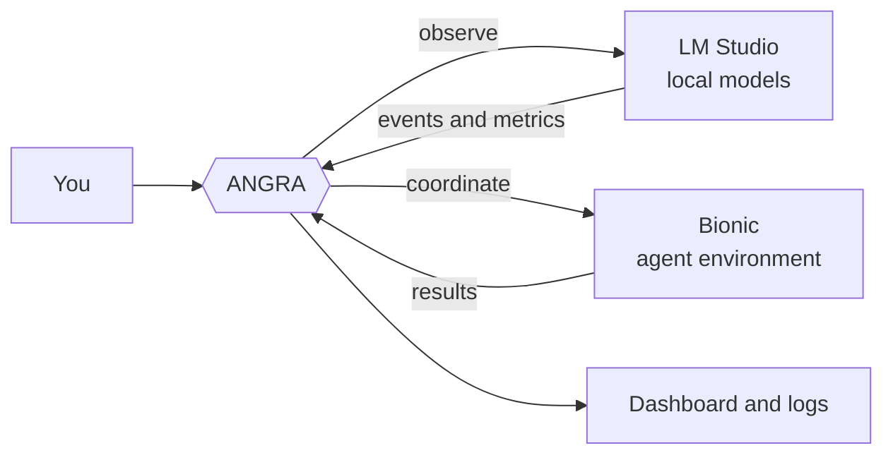

<div align="center">

# ANGRA

**Local-first observability and model-to-model coordination for LM Studio and Bionic.**


*Observe. Analyze. Verify. Challenge. Reconstruct. Coordinate.*


[Quick start](#quick-start) · [Features](#features) · [How it works](#how-it-works) · [Commands](#commands) · [Roadmap](#roadmap) · [Security](#security-model) · [Contributing](#contributing)

<!-- Add a demo GIF here: docs/assets/demo.gif -->

</div>

---

## What is ANGRA?

Running several local models does not automatically make them a team, and it
does not tell you what they are actually doing.

ANGRA is a single-file Python tool that sits **between** your local model
runtimes and you:

1. **See** what your local models are doing in real time (LM Studio).
2. **Let models work together** through explicit, scoped links instead of
   copy-pasting between chats (LM Studio and Bionic).

> Models should not only exchange answers. They should exchange **evidence**.

ANGRA is **not** a model, **not** an LLM, and **not** a replacement for
LM Studio or Bionic. It is the layer around them.


## Features

### Real-time observability (LM Studio)

- Model lifecycle monitoring (load / unload / active model)
- Streaming generation tracking
- Generation metrics: **tokens, latency, time to first token (TTFT), tokens/second**
- Context and performance analysis
- Tool-call visibility, where the runtime exposes it
- Reasoning events, **only when explicitly exposed** by the model or interface
- Resource monitoring

### Model collaboration

- Designate a **primary** model and **link** other models to it
- Grant link permissions **per session** (nothing is permanent by default)
- Relay structured evidence between models: verify, challenge, reconstruct
- Bionic integration with resource estimation and a configurable GPU budget

### Engineering principles

- **Zero dependencies.** Python standard library only. No `pip install`.
- **Single file per integration.** Copy it, run it, delete it.
- **Local-first.** Your prompts and outputs stay on your machine unless you
  deliberately configure otherwise.
- **Reversible.** Setup is idempotent, and `uninstall` removes what `install` added.
- **Safe defaults.** Automatic features are off until you turn them on.

## Quick start


### Requirements

- [LM Studio](https://lmstudio.ai) and/or Bionic installed
- Python 3
- At least one local model downloaded

### LM Studio

```bash
# 1. Put Angra_lmstudio.py in your user folder (e.g. C:\Users\<you>)
# 2. Install the `angra` command
py Angra_lmstudio.py install

# 3. Check that everything is wired correctly
angra doctor

# 4. Set a primary model and link a second one to it
angra primary "GPT-OSS-20B"
angra link "GPT-OSS-20B" "DeepSeek-Coder-V2-Lite"

# 5. Allow the link for this session only
angra allow "DeepSeek-Coder-V2-Lite" --session
```

### Bionic

```bash
py Angra_bionic.py

angra-bionic models                        # list available models
angra-bionic select                        # choose a model and confirm
angra-bionic enable                        # estimate resources, confirm, load
angra-bionic config set max_gpu_budget_gb 6
angra-bionic test
angra-bionic doctor
```

## Commands

### `angra` (LM Studio)

| Command | What it does |
| --- | --- |
| `install` | Installs the `angra` command (reversible) |
| `doctor` | Diagnoses setup, connectivity and permissions |
| `primary "<model>"` | Sets the primary model |
| `link "<A>" "<B>"` | Links model B to model A |
| `allow "<model>" --session` | Allows a link for the current session only |
| `uninstall` | Removes everything `install` added |

### `angra-bionic` (Bionic)

| Command | What it does |
| --- | --- |
| `models` | Lists available models |
| `select` | Choose a model and confirm |
| `enable` / `disable` | Estimate resources, confirm, load / unload |
| `config set <key> <value>` | Changes a setting, e.g. `max_gpu_budget_gb 6` |
| `test` | Runs a self-test |
| `status --json` | Machine-readable status |
| `doctor` | Diagnoses setup |
| `uninstall` | Removes everything it added |

## How it works



ANGRA does not run inference. It watches the runtime you already use,
records what happens, and relays structured context between models you have
explicitly linked.

A relayed message separates identity, task, context, constraints and result,
instead of forwarding an entire chat transcript:

```json
{
  "sender": "primary",
  "recipient": "reviewer",
  "type": "task_context",
  "objective": "Review the proposed fix",
  "context": [],
  "constraints": [],
  "status": "ready"
}
```

## Security model

Connecting models is a security boundary, not just a convenience.

- Access to a model does **not** imply access to files, a shell, the network,
  secrets or other models. Capabilities are scoped and explicit.
- Links are **session-scoped by default** (`--session`).
- Never expose an AI runtime directly to an untrusted network.
- Report vulnerabilities privately; see [SECURITY.md](SECURITY.md).

## Status

ANGRA is **alpha**. Interfaces may change between versions. Pin a specific
release for reproducible setups, and treat any feature not listed under
"Features" as experimental.

## Roadmap

- [x] LM Studio integration (`Angra_lmstudio.py`)
- [x] Bionic integration (`Angra_bionic.py`)
- [ ] Unified single-file build with live dashboard (Tkinter)
- [ ] Session storage (sqlite3 / JSON) and exportable reports
- [ ] Evaluation engine and anomaly levels (NORMAL / WATCH / WARNING / ANOMALY)
- [ ] Automated tests and CI
- [ ] Tagged releases with checksums
- [ ] Cross-machine workers (authenticated and encrypted)


## Contributing

Issues and pull requests are welcome. Good first areas: tests, Linux and
macOS support, docs and examples. Please read [CONTRIBUTING.md](CONTRIBUTING.md)
first.

## License

See [LICENSE](LICENSE).

## Author
https://shokribardiya.github.io/Oblivions0.github.io/
https://shokribardiya.github.io/OblivionStudioDev/
Built by **Bardiya Shokri** ([@shokribardiya](https://github.com/shokribardiya))
under the Oblivion project.
Website: <https://shokribardiya.github.io/Angra_AI/>

## Citation

If ANGRA helps your work, please cite it (see `CITATION.cff`).


